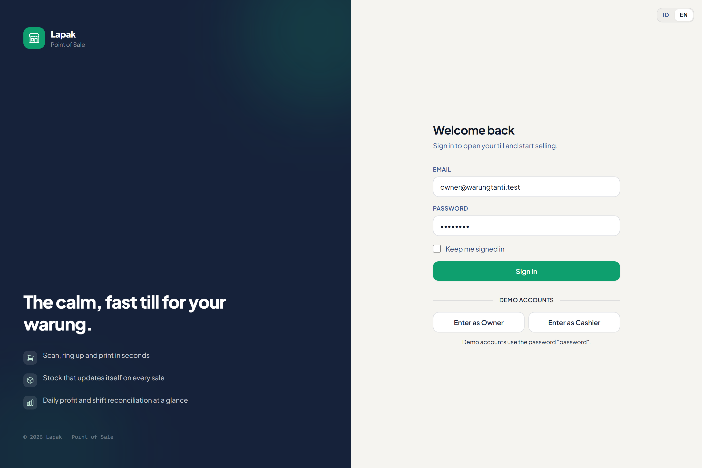
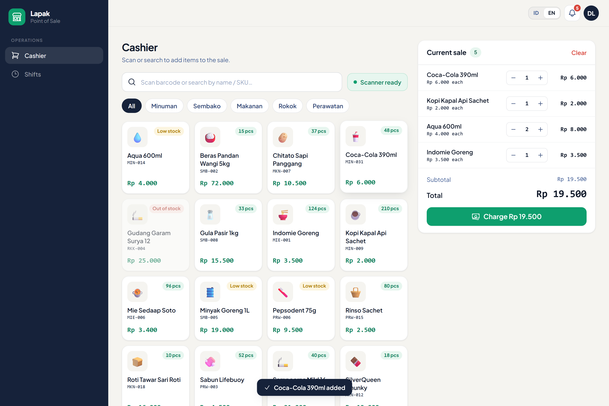
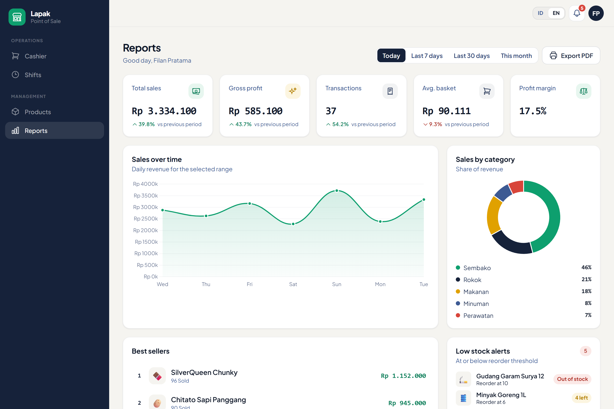
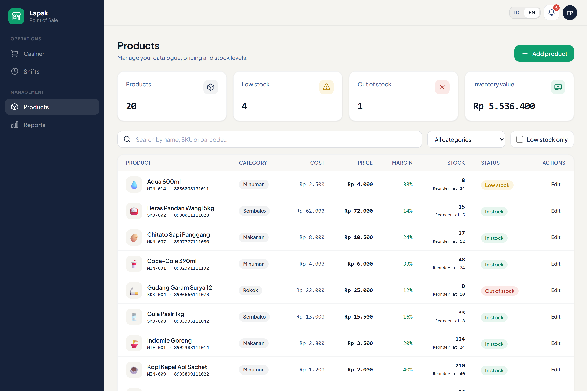
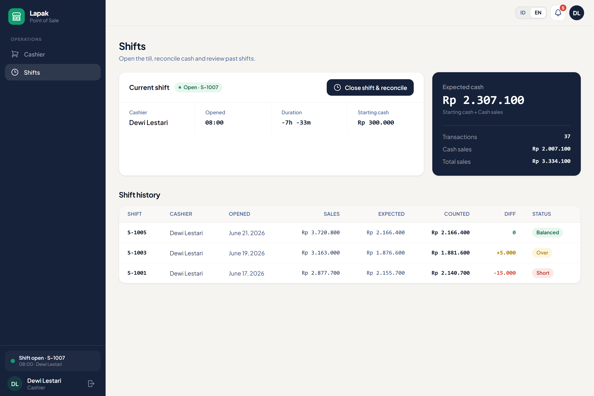

# Lapak — Point of Sale

> A calm, fast point-of-sale system for a small Indonesian *warung*. Ring up sales, track stock automatically, run cashier shifts, and read daily profit at a glance — in English or Bahasa Indonesia.

Lapak is a full-stack Laravel application built as a portfolio piece: a real, atomic sales engine behind a custom-designed interface, role-based access, and owner reporting with PDF export.

<p align="center">
  
</p>

---

## Highlights

- **Atomic checkout** — every sale runs inside a database transaction with row locking, so stock can never go negative and concurrent tills stay consistent.
- **Self-updating inventory** — each sale decrements stock and writes a `StockMovement` audit row; manual adjustments are logged too.
- **Cashier shifts** — open/close a till with a cash float, and reconcile expected vs. counted cash at close.
- **Owner reporting** — today-vs-yesterday deltas, a 7-day trend, category breakdown, top sellers, and shift reconciliation, with **PDF export**.
- **Role-based access** — owners manage products and see reports; cashiers ring up sales and run their own shifts. Enforced with [spatie/laravel-permission](https://spatie.be/docs/laravel-permission).
- **Bilingual** — full English / Bahasa Indonesia localization, switchable per user with no hardcoded UI strings.
- **Hardened image uploads** — product photos are MIME-sniffed server-side, re-encoded to compressed WebP, and stored in a no-exec directory.
- **Hardware-ready checkout** — a timing-based listener turns any USB/Bluetooth barcode scanner into keyboard input, and completed sales print straight to an ESC/POS thermal printer over **WebUSB** (with a browser print-dialog fallback when no printer is paired) — no drivers, no backend.

---

## Tech stack

| Layer        | Choice                                                              |
| ------------ | ------------------------------------------------------------------- |
| Framework    | Laravel 11 (PHP 8.2+)                                               |
| Frontend     | Blade + Alpine.js + Tailwind CSS 3, bundled with Vite 6             |
| Auth         | Laravel Breeze (Blade), rate-limited login, password reset/confirm  |
| Roles        | spatie/laravel-permission                                           |
| Images       | Intervention Image (GD) → WebP                                       |
| PDF          | barryvdh/laravel-dompdf                                             |
| Database     | SQLite (local dev) · MariaDB (deploy target)                        |
| Tests        | PHPUnit (in-memory SQLite)                                          |

---

## The four screens

- **POS** — touch-friendly product grid, live cart, change calculation, instant receipt.
- **Products** *(owner)* — CRUD with optional photo upload (or emoji), stock adjustment, low-stock flags.
- **Shifts** — open/close a till; cashiers see only their own history.
- **Reports** *(owner)* — sales, profit, trends, reconciliation, and PDF export.

---

## Screenshots

| <br>**Point of Sale** — live cart & change | <br>**Owner reports** — trends & profit |
| :---: | :---: |
| <br>**Products** — catalogue & stock | <br>**Shifts** — open till & reconciliation |

> The interface is fully bilingual (English / Bahasa Indonesia) — toggle in the top-right of every screen.

---

## Getting started (local)

**Requirements:** PHP 8.2+ with the **GD** extension, Composer, and Node.js 18+.

```bash
# 1. Install dependencies
composer install
npm install

# 2. Environment
cp .env.example .env
php artisan key:generate

# 3. Database — SQLite by default
touch database/database.sqlite        # Windows: type nul > database\database.sqlite
php artisan migrate:fresh --seed       # creates schema, roles, demo data

# 4. Build assets & serve
npm run dev                            # in one terminal
php artisan serve                      # in another → http://127.0.0.1:8000
```

> **Important:** always run `migrate:fresh --seed` after a fresh clone — roles and permissions are created by the seeder. Without it, role-protected routes will reject everyone.

### Demo logins

All seeded accounts use the password **`password`**.

| Role    | Email                     | Notes                                   |
| ------- | ------------------------- | --------------------------------------- |
| Owner   | `owner@warungtanti.test`  | Filan Pratama — full access             |
| Cashier | `dewi@warungtanti.test`   | Dewi Lestari — has today's open shift   |
| Cashier | `budi@warungtanti.test`   | Budi Santoso                            |

In **local/testing only**, the login screen also offers one-tap "Enter as Owner / Cashier" demo buttons. This passwordless shortcut is *not registered in production* — it exists purely for local exploration.

> The owner (Filan) has no open shift by default — open one before selling, or sign in as Dewi who already has one.

---

## Architecture notes

- **Atomic sale** — `PosController@store` wraps the whole checkout in `DB::transaction` with `lockForUpdate` on each product, validates the open shift, stock, and cash tendered, then creates the `Sale` + `SaleItem`s, decrements stock, and logs `StockMovement`s. Returns JSON; the Alpine cart updates local stock on success.
- **Cost snapshots** — each `SaleItem` stores a `cost_price_snapshot`, so historical profit stays accurate even after prices change.
- **RBAC** — there is no `role` column; roles live entirely in spatie tables. `User` uses the `HasRoles` trait, and `role:owner` middleware guards the management routes.
- **Image pipeline** — uploads are validated against a server-side MIME allow-list (JPG/PNG/WebP; SVG rejected), re-encoded to WebP at width ≤ 1000px, and written alongside an `.htaccess` that disables script execution in the upload directory.

---

## Testing

```bash
php artisan test     # PHP feature suite
npm run test:js      # ESC/POS receipt encoder (Node's built-in test runner)
```

Feature tests cover the guest redirect, role-based 403s, atomic stock decrement, and sale rejection when there's no open shift or insufficient stock, plus the inherited Breeze auth flows. The suite passes on both SQLite (CI/local) and MariaDB 10.4. The thermal-receipt byte encoder is unit-tested separately in pure Node — no browser or extra dependency.

---

## Deployment

The production target is a **MariaDB** shared host. Schema, the full seed, and the entire test suite are **verified green on MariaDB 10.4** (Laravel strict mode, `ONLY_FULL_GROUP_BY` included) — local dev just stays on SQLite for convenience.

A copy-paste production env template lives in [`.env.production.example`](.env.production.example), and the full step-by-step — database setup, asset build, document root, permissions, and a troubleshooting table — is in **[DEPLOY.md](DEPLOY.md)**.

---

## License

Built as a portfolio project. Laravel itself is [MIT licensed](https://opensource.org/licenses/MIT).
